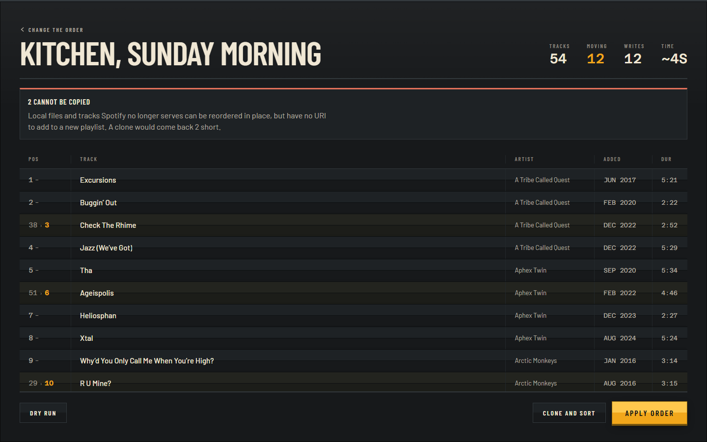
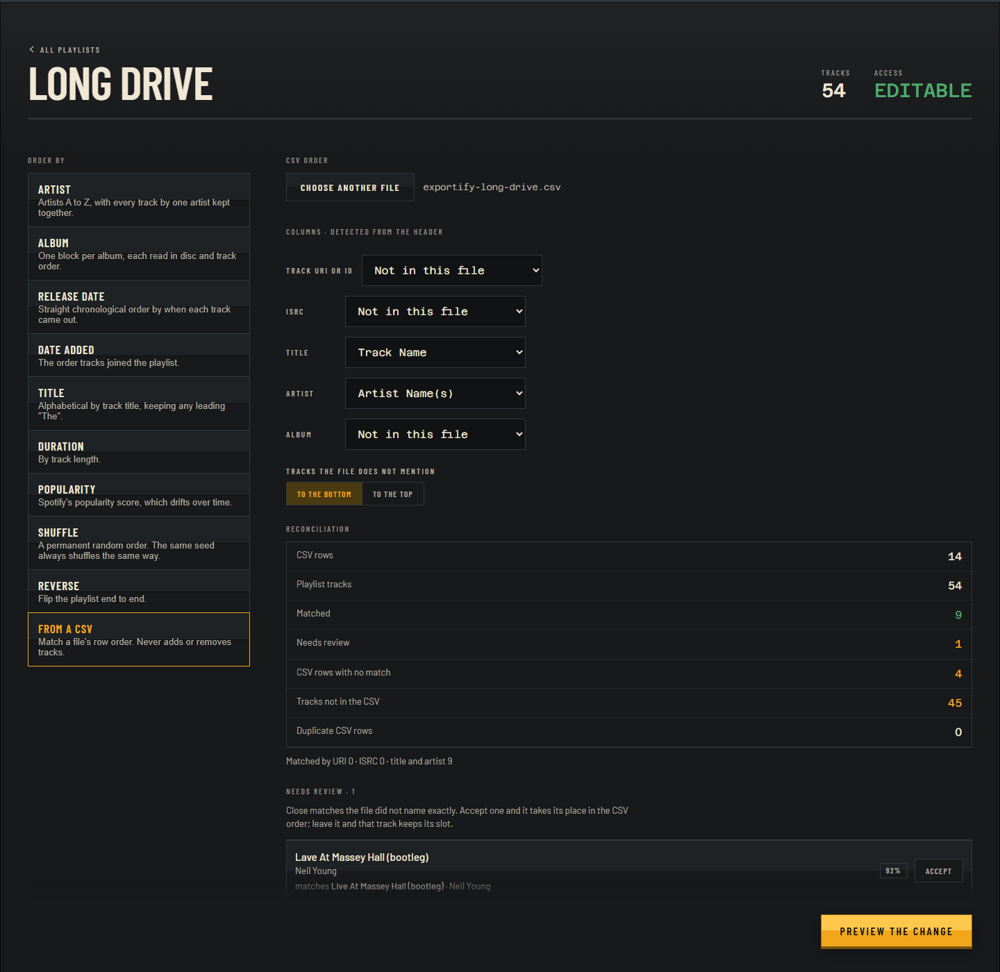
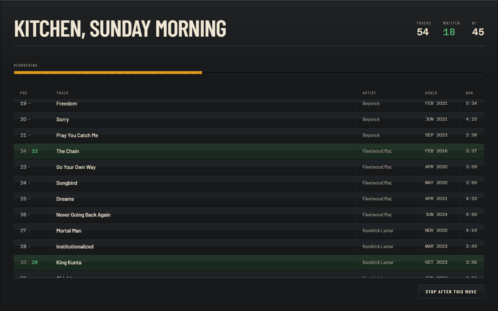

# Running Order

Sort a Spotify playlist into a lasting order — by artist, by album release,
by date added, by a CSV you supply — without losing when you added anything.

Spotify's own sort views are display-only. The only way to impose a permanent
order is to drag tracks one at a time. This does it in one deliberate action,
and shows you exactly what will change before it changes.



---

## Why it is not just a sort button

**It preserves `added_at`.** The obvious way to write a new order is to
replace the playlist's contents wholesale — which resets every track's
added-date to now and permanently destroys the data a date-added sort reads.
Sort once that way and that ordering is meaningless forever after. This moves
tracks instead, so a playlist can be re-sorted any number of times without
degrading.

**It moves only what has to move.** A longest-increasing-subsequence pass
leaves already-correct tracks untouched, so re-sorting after adding five songs
costs about five API calls rather than several hundred. Moving five tracks to
the front of a hundred costs exactly five.

**Nothing is written until you have read it.** Every run is
*fetch → plan → preview → execute*. The preview is the product; the write is
an afterthought. Undo is available after the fact, and a cancelled run leaves
a valid playlist.

---

## Sorting

| Strategy | Options |
|---|---|
| **Artist** | Artists A–Z, each artist's tracks kept together. Within an artist: date added · album release date (oldest album first, track order inside) · album name · title |
| **Album** | One block per album, read in disc and track order. Albums by release date or name |
| Release date · Date added · Title · Duration · Popularity | Ascending or descending |
| **Shuffle** | A *permanent* random order, seeded — the same seed always shuffles the same way, so it is reproducible and shareable |
| **Reverse** | Flip the playlist end to end |
| **From a CSV** | Match a file's row order |

There are deliberately no tempo, energy or mood sorts: Spotify withdrew the
audio-features endpoint for new apps in November 2024, and a control that
quietly fails is worse than one that does not exist.

### Sorting from a CSV



Drop in a CSV — Exportify's format is detected automatically, and any file can
be mapped by hand. Matching is tiered: track URI, then ISRC, then title plus
artist. Near misses are *proposed*, never applied, and wait for you to accept
them one at a time.

The CSV only ever reorders. It never adds or removes a track, and everything
it could not reconcile is counted and listed before anything is written.

---

## Watching it run



The interface is a split-flap departure board, because a playlist is an
ordered list whose whole purpose is that it rewrites itself. Rows that will
move show where they are now and where they are going; rows that stay show one
number and a dash. During a run each row inks green as its own write returns —
the motion is the progress, not a decoration beside it.

---

## Running it

You need a Spotify application of your own. There is no hosted version, no
server, and no shared credentials.

```bash
git clone <this repo>
cd running-order
npm install
npm start
```

Then open **`http://127.0.0.1:5173/`**.

`npm start` also launches the local YouTube Music proxy on port 8787. That
part needs a one-time Python setup (see [`proxy/README.md`](proxy/README.md));
until you do it the proxy will print an error and stop, and **the app carries
on working for Spotify** — it does not depend on the proxy. Use
`npm run dev:web` if you would rather not see the error at all.

### Setting up the Spotify app

1. Create an app at the [Spotify Developer Dashboard](https://developer.spotify.com/dashboard)
   and copy its **Client ID**. There is no client secret — this uses PKCE, so
   there is nothing to keep secret and nothing to leak.
2. Register the redirect URI **exactly**:
   ```
   http://127.0.0.1:5173/
   ```
   Trailing slash included.
3. Paste the Client ID into the app's first screen.

> **`localhost` will not work.** Spotify permits plain `http` only for loopback
> *IP literals*; `localhost` is a hostname that merely resolves to one, and is
> refused. The dev server therefore binds `127.0.0.1`, and the app refuses to
> start a sign-in from any origin Spotify would reject.

Two things worth knowing about Spotify's terms rather than this project's:
creating an app now requires a Premium account, though **using** one does not —
the playlist endpoints have never been Premium-gated. And an unreviewed app
stays in Development Mode, capped at 25 users you add by hand.

---

## Seeing it without an account

```bash
npm run dev
```

| URL | Shows |
|---|---|
| `/?demo=1` | A synthetic library |
| `/?demo=1&screen=preview&playlist=2` | The diff board, 12 tracks moving against 42 holding |
| `/?demo=1&screen=progress&playlist=2&progress=running` | A reorder in flight |
| `/?demo=1&screen=sort&csv=1` | A CSV loaded, with a match awaiting confirmation |
| `/?debug=1` | A request log: every call beside its response |

The demo data is synthetic and gated on `import.meta.env.DEV`, so it is
tree-shaken out of production builds entirely.

---

## Development

| Command | |
|---|---|
| `npm start` | **App and YouTube proxy together** — `127.0.0.1:5173` and `:8787` |
| `npm run dev:web` | The app alone |
| `npm run dev:proxy` | The YouTube proxy alone |
| `npm test` | The suite, once |
| `npm run test:watch` | Watch mode |
| `npm run lint` | Oxlint over `src` |
| `npm run build` | Production build |

**291 tests.** The architecture exists to make that possible: `model/`,
`sort/`, `csv/` and `plan/` are pure functions over plain arrays with no
network and no React, so the parts most likely to be subtly wrong are testable
without mocking anything.

Two of those tests carry most of the weight:

- **The reorder plan** is verified by replaying its generated operations
  against 300 random permutations and a 1,000-track playlist. Index arithmetic
  that is subtly wrong scrambles a real playlist, and only randomized replay
  catches it.
- **Every sort strategy** is asserted to return a permutation of its input —
  same length, same tracks. That single invariant is what makes "a sort can
  never lose a track" a guarantee rather than a hope.

Architecture, decisions and their rejected alternatives are in
[`docs/2026-09-09-design.md`](docs/2026-09-09-design.md). Build state is in
[`docs/STATUS.md`](docs/STATUS.md). The design system is in
[`DESIGN.md`](DESIGN.md).

---

## Status

Sorting works against real Spotify playlists, reads and writes both. All nine
strategies, the preview and the CSV pipeline have been exercised on a
414-track library, and on 2026-09-22 the write path completed end to end: an
in-place reorder, a multi-move reorder chaining snapshot ids across every
write, and clone-and-sort. **`added_at` survived the reorder** — the guarantee
the product rests on.

Not yet exercised live: a write at full scale — the largest real reorder so
far is a small playlist, not the 414-track one. The algorithm is property-
tested against 1,000 tracks, but that is a test, not a live run. Undo and
mid-run cancel have also not been run against the API. See
[`docs/STATUS.md`](docs/STATUS.md) for exactly what has and has not been run.

**Planned** — see
[`docs/2026-09-18-youtube-mirror-design.md`](docs/2026-09-18-youtube-mirror-design.md):

- **Mirroring a playlist onto YouTube Music.** Spotify stays canonical and
  sorting keeps happening there, because YouTube Music does not expose the
  metadata half these strategies need. A YouTube playlist is then made to
  match: missing tracks added, the rest reordered.
- **Confirmation before any cross-service write.** There is no shared
  identifier between the two services, so every match is a proposal — shown
  side by side with a link to play each, confirmed one at a time or in bulk
  where the evidence is strong. Nothing on YouTube is ever deleted.

---

## Licence

MIT — see [`LICENSE`](LICENSE).

Not affiliated with or endorsed by Spotify. You bring your own application
credentials and your own account.
